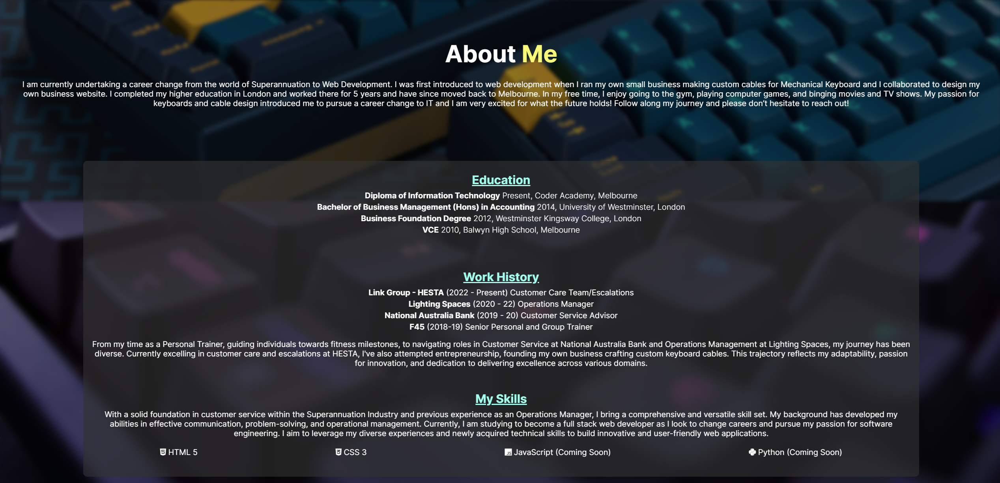

# Jess Lee - T1A2 Overview

Welcome to my Coder Academy T1A2 Portfolio! Please read below to familiarise yourself with my website.

## Website Link and GitHub Repository

Here is a link to my website: https://jesslee-portfolio.netlify.app/

GitHub Repository: https://github.com/jayel888/t1a2-portfolio

## Purpose

I have created this website as a format to showcase my skills and aptitude as an aspiring Web Developer! I have proudly coded and styled all web pages myself only utilising HTML and CSS. On my website you can explore content like future projects, a brief rundown of my education and employment history, blog posts and a page to cotact me directly! Please read below to familiarise yourself with the functionality of my website. 

## Website Functionality and Features

### Colour Palette

I decided to go with a primary dark grey theme with bright accent colours like teal and pink. Other complementary colours include a pastel blue and yellow. I had initially designed for my primary to be teal and a dark colour as secondary (as shown in my wireframes), however, during the process I decided I prefer the look and feel of the colours I have chosen. I really enjoy these colours as I think they contrast nicely with the darker tone and exhibit a neon theme.

### Navigation Bar

For my website, I have attempted a modern design navbar without a background displaying my logo on the far left (also serves as a home button) and all navigation links to the right. I had my logo designed a few years back and really love the symmetry of it, as it includes my initials JL. These include 'Home, About Me, Projects, Blogs and Contact'. Whilst displaying on a desktop, I have included hover effects, so the links subtely move upward and change colour. Like everything on this website, the navbar is responsive, so When displayed on a tablet or phone device, I have designed the navigation bar to turn collapsible, by using the checkbox function. I have also included an overlay so that viewers can click/touch anywhere on the screen to close the navbar, instead of only being able to close with the 'X' icon. 

### Footer

I have decided to implement a simple yet functional footer for my website. You will find link to my social media's including Facebook, Instagram, GitHub and LinkedIn. Below that will be a mini navigation bar, so you are able to navigate the website no matter where on the page you are. In keeping with my dark/neon theme, I have used my pink accent colour for a hover effect on the social links, making them highlight pink and move upwards when hovering over them. Upon clicking them, you will be directed to my socials that have been designed to open in a new tab. When viewed on a smaller device, the footer turns vertical by utilising flexbox. 

### About Me Page

I tried to keep my About Me page engaging enough for prospective employers, without filling it with essay amounts of text. I have included a short summary of my Education, Work History and Skills. 

### Projects and Blogs

For these pages I have created responsive cards using flexbox that wrap around each other depending on the device the website is viewed from. As I am just starting my journey to becoming a web developer, I do not have any projects to display yet. 

On my Blog page, you can clearly view each separate blog that increases in size as they are hovered over. In the actual blog posts, I have styled it with a standard layout using flexbox, having the placeholder article text wrap around the cover image, then dropping below when the screen becomes small enough. 

### Contact Me

I attempted to design a simple yet modern looking contact me page. Again using flexbox to move everything central of the page, you will see personal details shown on the left with icons and a input field to contact me directly on the right.
When displayed on smaller devices, the layout switches to a column direction, with the input fields changing size to utilise blank space. 

A link (URL) to your published portfolio website
A link to your GitHub repo
Description of your portfolio website, including,
Purpose
Functionality / features
Screenshots
Sitemap
Target audience
Tech stack (e.g. html, css, deployment platform, etc)